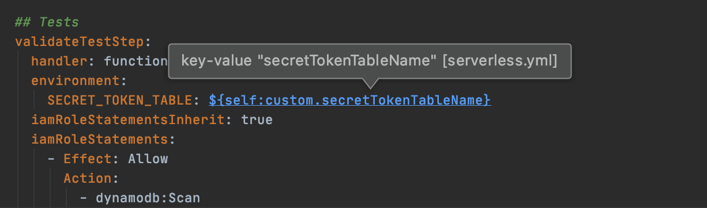
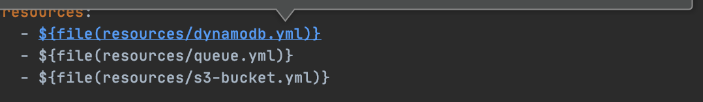
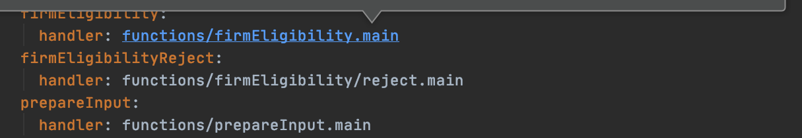
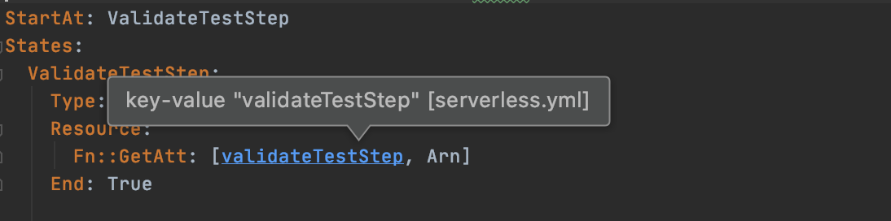
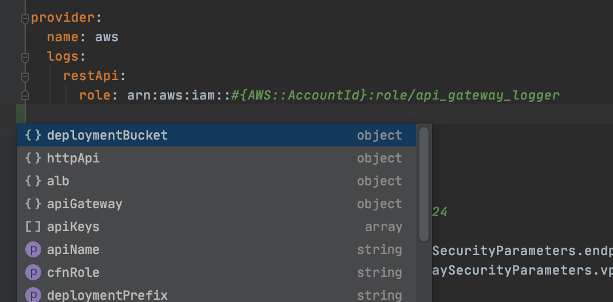
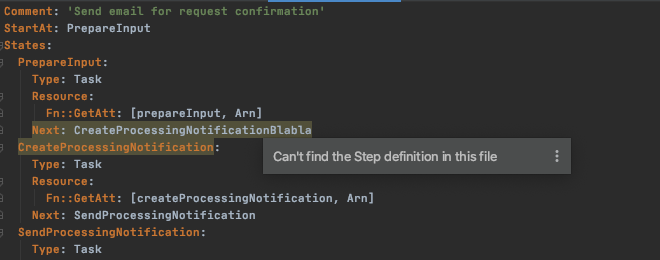
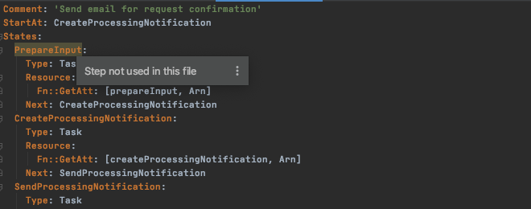
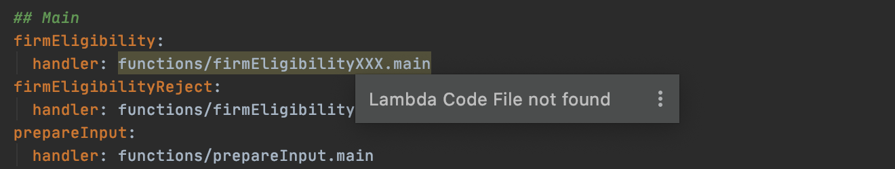
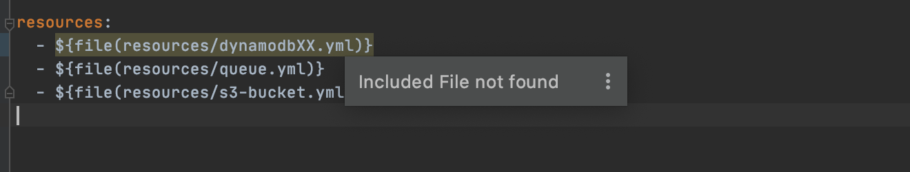

# serverless-ide-plugins
Add Navigation/Completion/Syntax on SERVERLESS files

<h3>Navigations</h3>

- Navigation within serverless.yml file (find resources): `${self:xxx.yyy.zzz}`  
Go directly to `xxx.yyy.zzz` defined in the file or in another Yaml file.
If the tag `xxx.yyy.zzz` is not found, search the longest matching sub tag if exist (`xxx.yyy` then `xxx`)

- Navigation from serverless.yml to imported files: `$file(./directory/an_included_file.yml)` 

- Navigation from serverless.yml lambda definitions to code (TS, JS, PY) 
Search for `handler` tag located under `functions` tag. Then open the associated code file.

- Navigation from a given step in state machine to lambda definition (found in any Yaml file) 
Search for `Fn::GetAtt: [XXXX, Arn]` located inside Step in State Machine definition.  
Then jump to `XXXX` definition found in serverless files.

- Navigation from state machine "step" usage to "step" definition 
Search for `Next: XXXX` or `Default: XXXX`tags in state machine definition. 
Then jump to `XXXX` step found in the current file (if exists)

<h3>Code Completion</h3>

- Code completion for AWS serverless file 
Relies on https://github.com/DefinitelyTyped/DefinitelyTyped/tree/master/types/serverless types definition. 
Provides Completion for AWS provider tags.

<h3>Syntax Inspections</h3>

- Syntax highlighting of errors: step not found 
Search for Steps used in a given State Machine (within `Next` or `Default` tags), not found in the file.

- Syntax highlighting of errors: step unused (dead code) 
Search for Steps defined in a given State Machine not used within `Next` or `Default` tags. Unreachable code

- Syntax highlighting of errors: lambda code file not found 
Search for lambda definition with erroneous associated code file 

- Syntax highlighting of errors: an included file not found 
Search for include tags leading to non existing included file.

XXXX